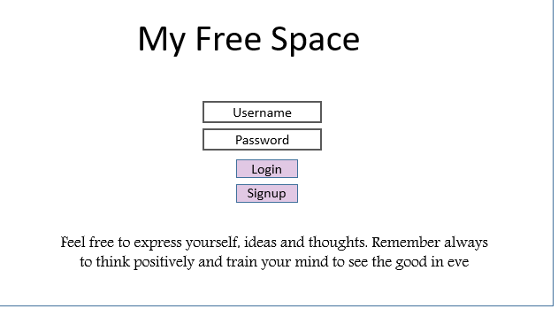
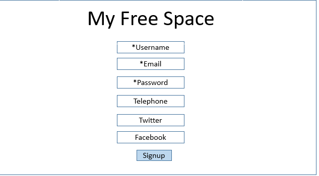
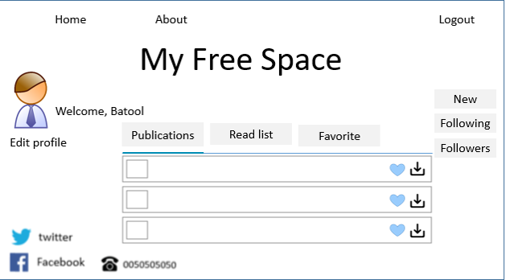
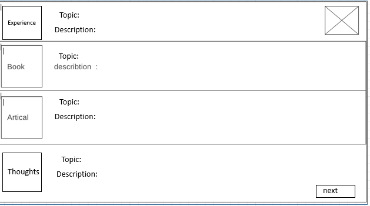
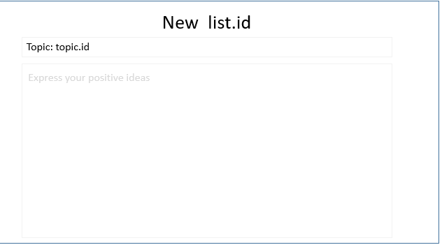
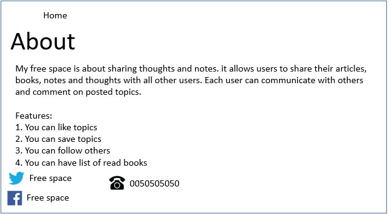

# Project 2

###  Idea
Our application is about sharing thoughts and notes. it allows users to share their articles, books, notes and thoughts with all other users. Each user can communicate with others and comment on posted topics.

###  Features
1. users can like topics
1. users can save topics
1. users can follow each other
1. users can have list of read books

###  Wireframe 
* The login page
---------

* Signup page
---------

* Profile page
----------

* New Post
-----------

* Typing and adding the topic
--------------

* About page
-------------

